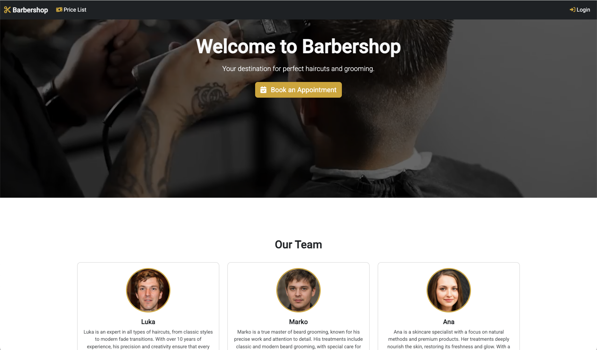

# 💈 BarberShop Booking Web Application

A full-featured web application designed for seamless booking of services in hair salons and barbershops. This system provides a streamlined experience for both customers and administrators, simplifying the scheduling process while maintaining control and flexibility over service management.

## 📌 Project Overview

This web application allows users to **easily book appointments** at a barbershop or hair salon. It features an intuitive UI for clients and a robust admin panel for staff to manage services, appointments, and users. With real-time SMS notifications and dynamic currency conversion, the system is user-friendly, efficient, and scalable.

## 🚀 Features

### 👤 User Features

- **User Registration and Login**
  Secure sign-up and login system for customers.

- **Profile Management**
  Users can update their personal information and change their passwords.

- **Barber Overview**
  A visually rich home page displaying a list of barbers with photos, bios, and working hours.

- **Appointment Booking**
  Book available time slots for specific services with a minimum of 1-hour advance notice.

- **Appointment Cancellation**
  Easily cancel booked appointments through the user dashboard.

- **Location and Contact Info**
  View the salon’s location on a map along with business hours and contact details.

- **Service Price List**
  Services are displayed with pricing in multiple currencies via a currency conversion API.

- **SMS Notifications**
  Users receive real-time SMS notifications (via Twilio) upon successful booking or cancellation.


### 🛠️ Admin Features

- **CRUD Operations**
  Add, update, or delete barbers, services, and users.

- **Role Management**
  Assign and manage user roles (e.g., user, admin).

- **Appointment Dashboard**
  View all scheduled appointments categorized by barber.

- **Appointment Management**
  Cancel or mark appointments as completed (only after the scheduled time has passed).


## 🧰 Technologies & Integrations

- **Backend:** Node.js with Express
- **Frontend:** Angular
- **Database:** MongoDB
- **Twilio API** – For sending SMS notifications to users.
- **Currency Conversion API** – For displaying service prices in different currencies.

## 📷 Screenshots

### Homepage


### Booking Page


### Appointment Dashboard


### Services


### Barbers


### Users


## 📦 Installation & Setup

This project consists of two main parts: **frontend** (Angular) and **backend** (Node.js + Express in TypeScript).  
Each part must be set up and run separately.


### 🔧 Prerequisites

- Node.js (v16 or newer)
- Angular CLI (install globally if not already)
  ```bash
  npm install -g @angular/cli
  ```

### Clone the Repository
```bash
git clone https://github.com/lknezevicc/BarbershopWebsite.git
cd BarbershopWebsite
```

### Backend Setup
```bash
# Navigate to backend folder
cd backend

# Install dependencies
npm install

# Start backend development server
npx nodemon
```

### Frontend Setup
```bash
# Open a new terminal window/tab
cd frontend

# Install dependencies
npm install

# Start the Angular development server
ng serve
```
